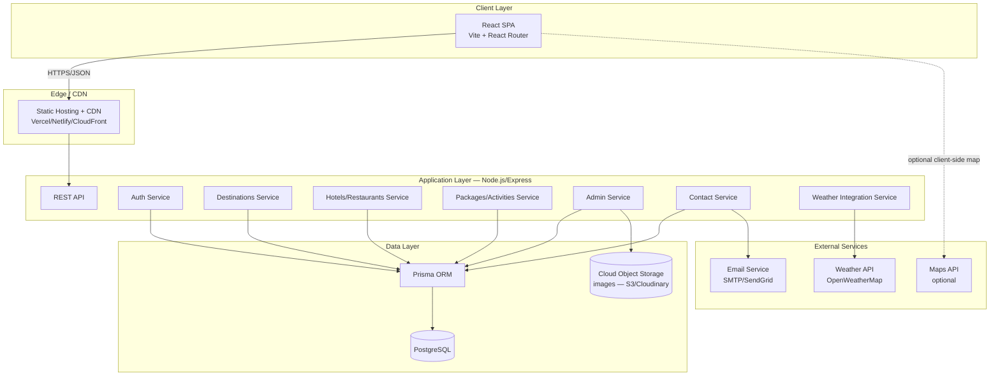
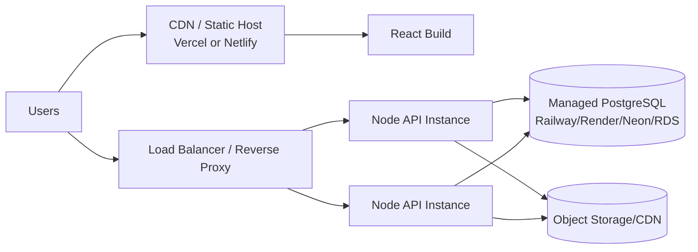
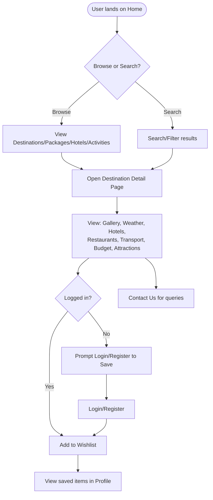
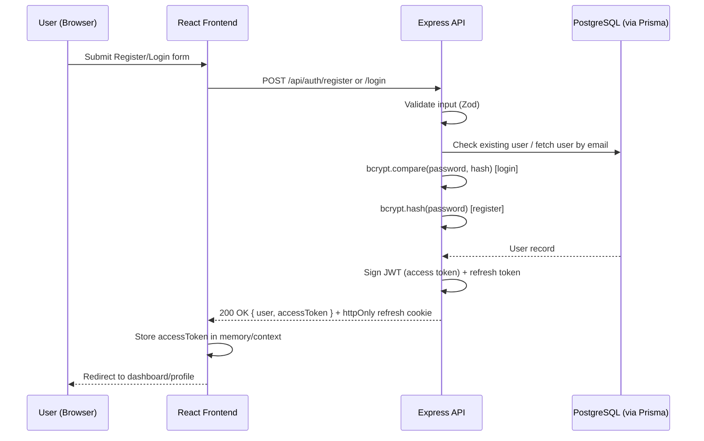
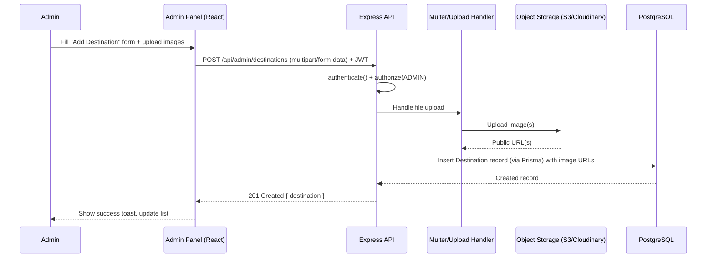
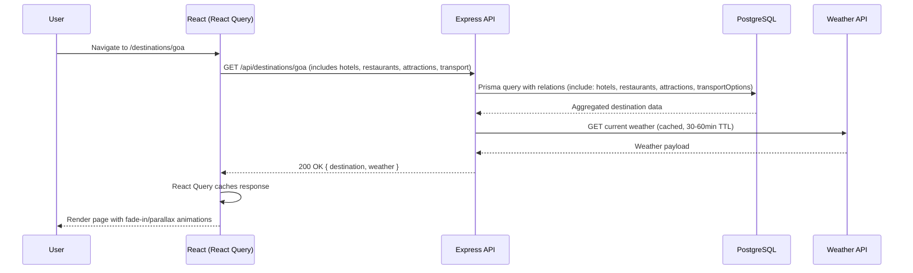
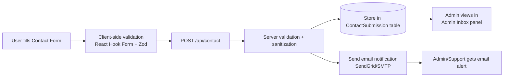

# TravelExplore — Travel & Tourism Management Web Application
### Complete Project Documentation
**Version:** 1.0 | **Date:** September 17, 2026 | **Prepared as:** PRD + Technical Architecture + System Workflow + Security Architecture + Technology Stack

**Project Type:** Showcase / discovery platform (no live booking or payment processing)
**Auth Scope:** Full user authentication + Admin panel for content management

---

# Table of Contents
1. [Product Requirements Document (PRD)](#1-product-requirements-document-prd)
2. [Technical Architecture](#2-technical-architecture)
3. [System Workflow](#3-system-workflow)
4. [Security Architecture](#4-security-architecture)
5. [Technology Stack](#5-technology-stack)
6. [Project Structure](#6-project-structure)
7. [Database Schema (Prisma)](#7-database-schema-prisma)
8. [API Endpoint Reference](#8-api-endpoint-reference)
9. [Open Questions / Assumptions](#9-open-questions--assumptions)

---

# 1. Product Requirements Document (PRD)

## 1.1 Purpose
TravelExplore is a modern, responsive web application that helps users **discover and explore popular tourist destinations**. It presents rich destination content — images, hotels, restaurants, transport options, budget estimates, weather, and local attractions — in a visually polished, animation-driven interface. This release is a **content/discovery platform**, not a transactional booking engine: users browse and save information; they do not pay or reserve inside the app.

## 1.2 Goals & Objectives
- Provide a single, trustworthy source for destination research (replacing scattered blog/Google searches).
- Present information in a visually engaging, mobile-first UI with smooth, professional animation.
- Allow registered users to save destinations/packages to a personal wishlist.
- Give administrators a clean CMS-style panel to manage destinations, hotels, restaurants, packages, and activities without touching code.
- Keep the stack simple, maintainable, and cheap to host (single Postgres DB, single Node API, static React frontend).

## 1.3 Target Audience
| Persona | Description | Needs |
|---|---|---|
| **Leisure Traveler** | Plans 1–3 trips/year, browses on mobile in the evening | Fast visuals, budget clarity, weather, "things to do" |
| **Budget Backpacker** | Cost-sensitive, compares transport & stay options | Transparent budget breakdown, transport comparison |
| **Family Planner** | Plans for 3–5 people, cares about safety & logistics | Family-friendly tags, local guide, contact/support |
| **Admin / Content Editor** | Internal staff maintaining destination data | Simple CRUD panel, image upload, no dev involvement |

## 1.4 Scope

### In Scope (v1.0)
- Public marketing/discovery site with 7 core sections: Home, Destinations, Packages, Hotels, Activities, Travel Guide, Contact Us.
- Destination detail pages (images, overview, weather, attractions, hotels, restaurants, transport, estimated budget).
- User registration/login, profile, "My Wishlist" (save destinations/packages).
- Admin panel (role-protected) for CRUD on destinations, hotels, restaurants, packages, activities, and blog/guide articles.
- Contact form (stored in DB + optional email notification).
- Live weather widget per destination (3rd-party API).
- Responsive design (mobile, tablet, desktop) with fade-in, slide-up, hover, parallax, and page-transition animations.

### Out of Scope (v1.0) — candidates for v2
- Real booking engine, payment gateway (Stripe/Razorpay), inventory/availability management.
- Real-time chat, multi-language i18n, reviews/ratings system with moderation.
- Native mobile apps.
- AI itinerary generation.

> These are flagged so nothing is silently half-built; they can be added later without re-architecting the core.

## 1.5 Core Features by Section

| Section | Description | Key Data Shown |
|---|---|---|
| **Home** | Hero with parallax, featured destinations carousel, search bar, testimonials, stats counter | Top 6–8 destinations, CTA |
| **Destinations** | Grid/list of all destinations, filter (continent, budget, season) + search | Card: image, name, country, short tagline, avg. budget |
| **Destination Detail** | Full destination page | Gallery, overview, weather, best time to visit, attractions, hotels, restaurants, transport, budget breakdown, map |
| **Packages** | Curated multi-destination/duration packages (informational, not bookable) | Itinerary outline, inclusions, estimated price range |
| **Hotels** | Browsable hotel listings, filterable by destination/price/rating | Name, image, star rating, price/night estimate, amenities |
| **Activities** | Things-to-do catalog across destinations | Category (adventure/culture/food/nature), duration, difficulty |
| **Travel Guide** | Blog-style articles: tips, visa info, packing lists, safety | Article list + detail with rich text/images |
| **Contact Us** | Contact form + FAQ + office/support info | Name, email, subject, message → stored + emailed |
| **Auth** | Register, login, forgot password, profile, wishlist | JWT session, saved items |
| **Admin Panel** | Protected `/admin` dashboard | CRUD for all content entities, image upload, contact submissions inbox |

## 1.6 Non-Functional Requirements
- **Performance:** First Contentful Paint < 2s on 4G; images lazy-loaded & optimized (WebP); Lighthouse performance score ≥ 85.
- **Responsiveness:** Fully usable from 320px to 4K; touch-friendly targets on mobile.
- **Accessibility:** WCAG 2.1 AA — semantic HTML, alt text, keyboard navigation, color contrast, `prefers-reduced-motion` respected for animations.
- **Animation quality:** Animations must be GPU-accelerated (transform/opacity only), no layout thrash, capped at 60fps, disabled/reduced for users with reduced-motion preference.
- **SEO:** Server-rendered meta tags per destination (via SSR or pre-rendering if needed), semantic headings, sitemap.xml.
- **Availability:** 99.5% uptime target for production.
- **Scalability:** Stateless API (horizontally scalable), DB connection pooling via Prisma.
- **Maintainability:** Admin-editable content — no redeploy needed to add a destination.

## 1.7 Success Metrics (KPIs)
- Avg. session duration > 2.5 minutes.
- Bounce rate < 45% on destination pages.
- Wishlist save rate (saves per session).
- Contact form conversion rate.
- Admin content-publish time (target: < 3 minutes to add a new destination).

## 1.8 User Stories (Sample)
- *As a traveler*, I want to filter destinations by budget so I can find trips I can afford.
- *As a traveler*, I want to see current weather for a destination so I can plan what to pack.
- *As a registered user*, I want to save destinations to a wishlist so I can revisit them later.
- *As an admin*, I want to add/edit a destination with images and details without asking a developer.
- *As an admin*, I want to view and respond to contact form submissions in one place.

## 1.9 Assumptions
- No real-time payment or booking is required at this stage (confirmed by user).
- Weather and (optionally) map data come from a free-tier third-party API.
- Content (destinations, hotels, etc.) is managed by admins, not user-generated.

---

# 2. Technical Architecture

## 2.1 Architecture Style
A **decoupled 3-tier architecture**: React SPA (frontend) ↔ REST API (Node/Express) ↔ PostgreSQL (via Prisma ORM). Stateless JWT-based auth allows the API to scale horizontally behind a load balancer if needed.



## 2.2 Frontend Architecture (React.js)
- **Build tool:** Vite (fast HMR, small bundles) — alternative: Create React App (not recommended, legacy).
- **Routing:** React Router v6 (`/`, `/destinations`, `/destinations/:slug`, `/packages`, `/hotels`, `/activities`, `/guide`, `/guide/:slug`, `/contact`, `/login`, `/register`, `/profile`, `/wishlist`, `/admin/*`).
- **State management:**
  - Local/UI state → React `useState`/`useReducer`.
  - Server state (data fetching/caching) → **TanStack Query (React Query)** for caching, loading/error states, background refetch.
  - Auth/global state → React Context (`AuthContext`) storing user + token.
- **Styling:** Tailwind CSS (utility-first, fast to theme, pairs well with animation libraries) + a small design-tokens file for brand colors/typography.
- **Animation libraries:**
  - **Framer Motion** — page transitions, fade-in/slide-up on scroll, animated buttons, modal/drawer transitions.
  - **AOS (Animate On Scroll)** or Framer Motion's `whileInView` — scroll-triggered reveals.
  - **CSS `transform`/`will-change`** for hover/zoom effects (hardware-accelerated, no JS needed for simple hovers).
  - Native CSS/Framer Motion `parallax` via `useScroll`/`useTransform` for hero parallax.
  - Skeleton loaders (custom or `react-loading-skeleton`) for perceived-performance loading states.
- **Forms:** React Hook Form + Zod for validation (login, register, contact, admin forms).
- **HTTP client:** Axios with interceptors (attach JWT, handle 401 refresh/redirect).
- **Image handling:** `loading="lazy"`, responsive `srcSet`, WebP where possible, blur-up placeholders.

### Component Architecture (high level)
```
App
├── Layout (Navbar, Footer, ScrollToTop, PageTransition wrapper)
├── Public Pages
│   ├── Home (Hero/Parallax, FeaturedDestinations, SearchBar, Testimonials, StatsCounter)
│   ├── Destinations (Filters, DestinationGrid, DestinationCard)
│   ├── DestinationDetail (Gallery, Overview, WeatherWidget, AttractionsList,
│   │                       HotelsList, RestaurantsList, TransportOptions, BudgetEstimator, MapEmbed)
│   ├── Packages (PackageGrid, PackageCard, PackageDetail)
│   ├── Hotels (HotelFilters, HotelGrid, HotelCard)
│   ├── Activities (ActivityFilters, ActivityGrid, ActivityCard)
│   ├── TravelGuide (ArticleList, ArticleDetail)
│   └── Contact (ContactForm, FAQAccordion, MapEmbed)
├── Auth Pages (Login, Register, ForgotPassword, Profile, Wishlist)
├── Admin (ProtectedRoute → AdminLayout → Dashboard, ManageDestinations,
│           ManageHotels, ManageRestaurants, ManagePackages, ManageActivities,
│           ManageGuideArticles, ContactSubmissionsInbox, ManageUsers)
└── Shared UI (Button, Card, Modal, Loader, ImageUploader, Toast, ProtectedRoute)
```

## 2.3 Backend Architecture (Node.js + Express.js)
- **Pattern:** Layered architecture — `routes → controllers → services → Prisma (data access)`. Keeps controllers thin and business logic testable.
- **Structure per module** (e.g., `destinations`): `destination.routes.js`, `destination.controller.js`, `destination.service.js`, `destination.validation.js` (Zod/Joi schema).
- **Middleware pipeline:** `helmet → cors → rate-limiter → json-body-parser → morgan(logging) → route → error-handler`.
- **Auth middleware:** `authenticate` (verifies JWT) and `authorize(role)` (checks `ADMIN` vs `USER`) guard protected/admin routes.
- **File uploads:** `multer` for handling multipart image uploads → streamed to cloud object storage (S3/Cloudinary) → URL stored in DB (not binary blobs in Postgres).
- **Centralized error handling:** custom `AppError` class + a single Express error-handling middleware returning consistent JSON error shape.
- **Environment config:** `dotenv` + a validated config module (fails fast if required env vars missing).

## 2.4 Database Layer (PostgreSQL + Prisma ORM)
- **Prisma** chosen over raw SQL/Sequelize for: type-safe queries, auto-generated migrations, excellent DX, built-in protection against SQL injection.
- Connection pooling via Prisma's built-in pool (or PgBouncer in production for serverless deployments).
- See full schema in [Section 7](#7-database-schema-prisma).

## 2.5 Third-Party Integrations
| Integration | Purpose | Notes |
|---|---|---|
| **OpenWeatherMap API** | Live weather per destination | Cached server-side (e.g., 30–60 min TTL) to avoid rate limits |
| **Cloudinary or AWS S3** | Image storage/CDN for destinations, hotels, uploads | Admin uploads route through backend → storage |
| **SendGrid / Nodemailer + SMTP** | Contact form email notifications | Also optional welcome/verification emails |
| **Google Maps Embed / Mapbox (optional)** | Show destination location | Free-tier embed, no API key exposed if using simple embed |

## 2.6 Deployment Architecture (suggested)

- **Frontend:** Vercel/Netlify (static build, global CDN, instant rollback).
- **Backend:** Render/Railway/AWS ECS/EC2 behind a reverse proxy (Nginx) or managed platform load balancer.
- **Database:** Managed Postgres (Neon, Railway, Render, or AWS RDS) with automated backups.
- **CI/CD:** GitHub Actions — lint/test on PR, auto-deploy `main` to staging, manual promote to production.

---

# 3. System Workflow

## 3.1 High-Level User Journey


## 3.2 Authentication Workflow


## 3.3 Admin Content Management Workflow


## 3.4 Destination Detail Page Data Flow


## 3.5 Contact Form Workflow


---

# 4. Security Architecture

## 4.1 Guiding Principle
Defense in depth: no single control is trusted alone. Security is enforced at the network edge, the application layer, the data layer, and in the frontend.

## 4.2 Authentication & Authorization
- **Password storage:** `bcrypt` (cost factor ≥ 12) — never store plaintext or reversible-encrypted passwords.
- **Session strategy:** Short-lived **JWT access tokens** (e.g., 15 min) + long-lived **httpOnly, Secure, SameSite=Strict refresh token** cookie for silent renewal. Access tokens are kept in memory on the client (not `localStorage`) to reduce XSS token theft risk.
- **Role-Based Access Control (RBAC):** `USER` and `ADMIN` roles stored on the `User` model; `authorize(['ADMIN'])` middleware guards every `/api/admin/*` route on the **server** (never trust a hidden frontend route alone).
- **Account protections:** rate-limited login attempts, generic error messages ("invalid credentials" — never reveal whether the email exists), optional email verification on registration, forgot-password flow using a signed, single-use, time-limited token.

## 4.3 Input Validation & Data Integrity
- All request bodies validated server-side with **Zod/Joi** schemas — client-side validation is UX only, never a security boundary.
- **Prisma ORM** parameterizes all queries by design → eliminates classic SQL injection vectors (no raw string concatenation into SQL).
- File upload validation: strict MIME-type allowlist (jpeg/png/webp), file size limits, filename sanitization, virus/malware scan hook if budget allows, files never executed from the upload directory.

## 4.4 Web Application Security Controls
| Threat | Mitigation |
|---|---|
| **XSS (Cross-Site Scripting)** | React auto-escapes JSX output; avoid `dangerouslySetInnerHTML`; sanitize any rich-text/HTML (e.g., travel guide articles) with `DOMPurify` before render and on save |
| **CSRF** | SameSite=Strict cookies for refresh token; state-changing requests require valid JWT in `Authorization` header (not cookie-only auth), so classic CSRF form-submission attacks don't apply to the API |
| **SQL Injection** | Prisma parameterized queries; no raw SQL string interpolation |
| **Clickjacking** | `helmet` sets `X-Frame-Options: DENY` / CSP `frame-ancestors 'none'` |
| **MITM / Eavesdropping** | Enforce HTTPS everywhere (HSTS header), redirect all HTTP → HTTPS |
| **Brute force** | `express-rate-limit` on `/auth/*` routes (e.g., 5 attempts/15min per IP) + optional CAPTCHA on repeated failures |
| **Mass assignment** | DTOs/Zod schemas whitelist exactly which fields can be set — `role` is never accepted from client input on registration/profile updates |
| **Sensitive data exposure** | `.env` secrets never committed (gitignored); DB credentials, JWT secret, API keys pulled from environment/secret manager; error responses never leak stack traces in production |
| **Dependency vulnerabilities** | `npm audit` / Dependabot in CI; pin versions; review before upgrading |
| **Denial of Service** | Global rate limiting (`express-rate-limit`), request body size limits, pagination enforced on list endpoints (no unbounded queries) |

## 4.5 Security Headers (via `helmet`)
- `Content-Security-Policy` — restricts script/style/image sources to trusted origins (self, CDN, image storage host).
- `X-Content-Type-Options: nosniff`
- `Strict-Transport-Security` (HSTS)
- `Referrer-Policy: strict-origin-when-cross-origin`
- `X-Frame-Options: DENY`

## 4.6 CORS Policy
- API configured with an explicit **allowlist** of origins (frontend domain(s) only) — never `origin: '*'` in production, especially since credentials (cookies) are involved.

## 4.7 Infrastructure & Operational Security
- Principle of least privilege on DB credentials (a scoped app user, not the Postgres superuser).
- Automated encrypted backups of the database; tested restore procedure.
- Centralized logging (e.g., Pino/Winston) with request IDs; **no PII or passwords ever logged**.
- Audit trail for admin actions (who created/edited/deleted which record, timestamped) — supports accountability for content changes.
- Dependency and container image scanning in CI/CD before deploy.
- Secrets managed via platform secret manager (Render/Vercel/AWS Secrets Manager) — not hardcoded, not in the repo.

## 4.8 Privacy & Compliance Considerations
- Contact form and account data are personal data — document a simple privacy policy, provide account deletion capability, avoid collecting more than needed (data minimization).
- Cookie consent banner if any non-essential tracking/analytics cookies are added later.

---

# 5. Technology Stack

## 5.1 Frontend
| Category | Technology | Why |
|---|---|---|
| Framework | **React.js 18+** | Component-driven, huge ecosystem, matches requirement |
| Build tool | **Vite** | Fast dev server, optimized production builds |
| Routing | **React Router v6** | Standard client-side routing |
| Styling | **Tailwind CSS** | Rapid, consistent, responsive styling; easy dark-mode/theme tokens |
| Animation | **Framer Motion**, AOS, native CSS transitions | Fade-in, slide-up, hover, parallax, page transitions — GPU-friendly |
| Server-state / caching | **TanStack Query (React Query)** | Caching, loading/error states, refetching for API data |
| Forms & validation | **React Hook Form + Zod** | Performant forms, shared validation schema with backend pattern |
| HTTP client | **Axios** | Interceptors for auth/refresh handling |
| Icons | **Lucide React** | Clean, consistent icon set |
| Maps (optional) | Mapbox GL JS or Google Maps Embed | Destination location display |

## 5.2 Backend
| Category | Technology | Why |
|---|---|---|
| Runtime | **Node.js (LTS 20+)** | Matches requirement, non-blocking I/O suits API workloads |
| Framework | **Express.js** | Minimal, mature, huge middleware ecosystem |
| ORM | **Prisma** | Type-safe queries, migrations, protects against SQL injection |
| Database | **PostgreSQL 15+** | Relational integrity for structured travel data, mature, free-tier hosting widely available |
| Auth | **jsonwebtoken + bcrypt** | Industry-standard stateless auth + secure password hashing |
| Validation | **Zod** (shared style with frontend) | Runtime schema validation |
| File uploads | **Multer** + Cloudinary/AWS SDK | Handle multipart uploads, push to object storage |
| Security middleware | **helmet, cors, express-rate-limit** | Standard hardening middleware |
| Logging | **Pino** or **Winston** + **Morgan** (HTTP logs) | Structured, queryable logs |
| Email | **Nodemailer** or **SendGrid SDK** | Contact form notifications |
| Environment config | **dotenv** | Local/staging/prod env separation |

## 5.3 Database & Infrastructure
| Category | Technology | Why |
|---|---|---|
| Database hosting | Neon / Railway / Render / AWS RDS (PostgreSQL) | Managed, automated backups, connection pooling |
| Object storage | AWS S3 or Cloudinary | Image hosting/CDN, keeps binaries out of Postgres |
| Frontend hosting | Vercel or Netlify | Git-based deploys, global CDN, preview deployments |
| Backend hosting | Render / Railway / AWS ECS | Simple container/service deploys, autoscaling options |
| CI/CD | GitHub Actions | Lint, test, build, deploy pipeline |
| Containerization (optional) | Docker + Docker Compose | Local dev parity (Postgres + API in containers) |

## 5.4 External APIs
| Purpose | Service |
|---|---|
| Weather | OpenWeatherMap (free tier) |
| Maps (optional) | Mapbox / Google Maps |
| Transactional email | SendGrid / Mailgun / SMTP |

## 5.5 Dev Tooling & Quality
- **ESLint + Prettier** (frontend & backend) — consistent code style.
- **Husky + lint-staged** — pre-commit lint/format checks.
- **Jest / Vitest** — unit tests (services, utils); **Supertest** for API integration tests; **React Testing Library** for component tests.
- **Postman/Insomnia collection** or **Swagger/OpenAPI** docs for the API.
- **Prisma Studio** — visual DB browser during development.

---

# 6. Project Structure

```
travel-explore/
├── client/                          # React frontend
│   ├── public/
│   ├── src/
│   │   ├── assets/
│   │   ├── components/
│   │   │   ├── common/               # Button, Card, Modal, Loader, Toast...
│   │   │   ├── layout/               # Navbar, Footer, PageTransition
│   │   │   └── sections/             # Hero, FeaturedDestinations, etc.
│   │   ├── pages/
│   │   │   ├── Home, Destinations, DestinationDetail
│   │   │   ├── Packages, Hotels, Activities, TravelGuide, Contact
│   │   │   ├── auth/ (Login, Register, ForgotPassword, Profile, Wishlist)
│   │   │   └── admin/ (Dashboard, ManageDestinations, ManageHotels, ...)
│   │   ├── context/                  # AuthContext
│   │   ├── hooks/                    # useAuth, useDestinations, useWeather...
│   │   ├── services/                 # api.js (axios instance), *.service.js
│   │   ├── utils/
│   │   ├── styles/                   # tailwind.css, animations.css
│   │   ├── App.jsx
│   │   └── main.jsx
│   ├── tailwind.config.js
│   ├── vite.config.js
│   └── package.json
│
├── server/                          # Node.js/Express backend
│   ├── src/
│   │   ├── modules/
│   │   │   ├── auth/                 # routes, controller, service, validation
│   │   │   ├── destinations/
│   │   │   ├── hotels/
│   │   │   ├── restaurants/
│   │   │   ├── packages/
│   │   │   ├── activities/
│   │   │   ├── travelGuide/
│   │   │   ├── contact/
│   │   │   ├── weather/
│   │   │   ├── upload/
│   │   │   └── admin/
│   │   ├── middleware/               # auth, authorize, errorHandler, rateLimiter
│   │   ├── config/                   # env.js, db.js, cors.js
│   │   ├── utils/                    # jwt.js, hash.js, logger.js
│   │   ├── prisma/
│   │   │   ├── schema.prisma
│   │   │   └── migrations/
│   │   ├── app.js
│   │   └── server.js
│   ├── .env.example
│   └── package.json
│
├── docker-compose.yml                # postgres + api (local dev)
├── .github/workflows/ci.yml
└── README.md
```

---

# 7. Database Schema (Prisma)

```prisma
// schema.prisma

datasource db {
  provider = "postgresql"
  url      = env("DATABASE_URL")
}

generator client {
  provider = "prisma-client-js"
}

enum Role {
  USER
  ADMIN
}

model User {
  id            String    @id @default(uuid())
  name          String
  email         String    @unique
  passwordHash  String
  role          Role      @default(USER)
  isVerified    Boolean   @default(false)
  wishlist      Wishlist[]
  createdAt     DateTime  @default(now())
  updatedAt     DateTime  @updatedAt
}

model Destination {
  id              String    @id @default(uuid())
  slug            String    @unique
  name            String
  country         String
  continent       String
  tagline         String?
  description     String
  bestTimeToVisit String?
  avgBudgetMin    Int?
  avgBudgetMax    Int?
  currency        String    @default("USD")
  latitude        Float?
  longitude       Float?
  images          DestinationImage[]
  attractions     Attraction[]
  hotels          Hotel[]
  restaurants     Restaurant[]
  transportOptions TransportOption[]
  wishlistedBy    Wishlist[]
  isPublished     Boolean   @default(true)
  createdAt       DateTime  @default(now())
  updatedAt       DateTime  @updatedAt
}

model DestinationImage {
  id            String       @id @default(uuid())
  url           String
  altText       String?
  destination   Destination  @relation(fields: [destinationId], references: [id], onDelete: Cascade)
  destinationId String
}

model Attraction {
  id            String       @id @default(uuid())
  name          String
  description   String?
  category      String?      // culture, nature, adventure, food...
  imageUrl      String?
  destination   Destination  @relation(fields: [destinationId], references: [id], onDelete: Cascade)
  destinationId String
}

model Hotel {
  id            String       @id @default(uuid())
  name          String
  description   String?
  starRating    Int?
  pricePerNight Int?
  currency      String       @default("USD")
  imageUrl      String?
  amenities     String[]
  destination   Destination  @relation(fields: [destinationId], references: [id], onDelete: Cascade)
  destinationId String
}

model Restaurant {
  id            String       @id @default(uuid())
  name          String
  cuisine       String?
  priceRange    String?      // $, $$, $$$
  imageUrl      String?
  destination   Destination  @relation(fields: [destinationId], references: [id], onDelete: Cascade)
  destinationId String
}

model TransportOption {
  id            String       @id @default(uuid())
  type          String       // flight, train, bus, car rental...
  description   String?
  estCost       Int?
  currency      String       @default("USD")
  destination   Destination  @relation(fields: [destinationId], references: [id], onDelete: Cascade)
  destinationId String
}

model Package {
  id           String    @id @default(uuid())
  slug         String    @unique
  title        String
  summary      String?
  durationDays Int
  priceMin     Int?
  priceMax     Int?
  currency     String    @default("USD")
  imageUrl     String?
  itinerary    Json?      // structured day-by-day outline
  isPublished  Boolean   @default(true)
  createdAt    DateTime  @default(now())
}

model Activity {
  id            String   @id @default(uuid())
  name          String
  category      String?  // adventure, culture, food, nature, relaxation
  description   String?
  durationHrs   Float?
  difficulty    String?  // easy, moderate, hard
  imageUrl      String?
  destinationId String?
  createdAt     DateTime @default(now())
}

model GuideArticle {
  id          String   @id @default(uuid())
  slug        String   @unique
  title       String
  coverImage  String?
  content     String    // sanitized rich text/markdown
  category    String?   // tips, visa, packing, safety
  isPublished Boolean  @default(true)
  publishedAt DateTime @default(now())
}

model Wishlist {
  id            String       @id @default(uuid())
  user          User         @relation(fields: [userId], references: [id], onDelete: Cascade)
  userId        String
  destination   Destination  @relation(fields: [destinationId], references: [id], onDelete: Cascade)
  destinationId String
  createdAt     DateTime     @default(now())

  @@unique([userId, destinationId])
}

model ContactSubmission {
  id        String   @id @default(uuid())
  name      String
  email     String
  subject   String?
  message   String
  isRead    Boolean  @default(false)
  createdAt DateTime @default(now())
}
```

---

# 8. API Endpoint Reference

## 8.1 Auth
| Method | Endpoint | Access | Description |
|---|---|---|---|
| POST | `/api/auth/register` | Public | Create account |
| POST | `/api/auth/login` | Public | Login, returns access token + refresh cookie |
| POST | `/api/auth/refresh` | Public (cookie) | Issue new access token |
| POST | `/api/auth/logout` | Authenticated | Clear refresh cookie |
| POST | `/api/auth/forgot-password` | Public | Send reset link |
| POST | `/api/auth/reset-password` | Public (token) | Set new password |
| GET | `/api/auth/me` | Authenticated | Get current user profile |

## 8.2 Public Content
| Method | Endpoint | Description |
|---|---|---|
| GET | `/api/destinations` | List destinations (filter: continent, budget, search, pagination) |
| GET | `/api/destinations/:slug` | Full destination detail (hotels, restaurants, attractions, transport) |
| GET | `/api/destinations/:slug/weather` | Live weather for destination |
| GET | `/api/packages` | List packages |
| GET | `/api/packages/:slug` | Package detail |
| GET | `/api/hotels` | List hotels (filter by destination/price/rating) |
| GET | `/api/activities` | List activities (filter by category/destination) |
| GET | `/api/guide` | List travel guide articles |
| GET | `/api/guide/:slug` | Article detail |
| POST | `/api/contact` | Submit contact form |

## 8.3 User (Authenticated)
| Method | Endpoint | Description |
|---|---|---|
| GET | `/api/wishlist` | Get current user's saved destinations |
| POST | `/api/wishlist/:destinationId` | Add to wishlist |
| DELETE | `/api/wishlist/:destinationId` | Remove from wishlist |
| PATCH | `/api/users/me` | Update profile |

## 8.4 Admin (Role: ADMIN)
| Method | Endpoint | Description |
|---|---|---|
| POST/PUT/DELETE | `/api/admin/destinations[/:id]` | CRUD destinations |
| POST/PUT/DELETE | `/api/admin/hotels[/:id]` | CRUD hotels |
| POST/PUT/DELETE | `/api/admin/restaurants[/:id]` | CRUD restaurants |
| POST/PUT/DELETE | `/api/admin/packages[/:id]` | CRUD packages |
| POST/PUT/DELETE | `/api/admin/activities[/:id]` | CRUD activities |
| POST/PUT/DELETE | `/api/admin/guide[/:id]` | CRUD guide articles |
| POST | `/api/admin/upload` | Upload image → returns URL |
| GET | `/api/admin/contact-submissions` | View contact inbox |
| PATCH | `/api/admin/contact-submissions/:id` | Mark as read |
| GET | `/api/admin/users` | List users (manage roles) |

---

# 9. Open Questions / Assumptions

These didn't block producing this document, but confirming them will refine the build:

1. **Content source for launch:** Will you supply real destination/hotel data, or should placeholder/seed data be generated for the first build?
2. **Weather/Maps API keys:** Do you already have API keys for OpenWeatherMap and/or a maps provider, or should the app be built to work with free-tier defaults?
3. **Image storage preference:** Cloudinary (simpler, generous free tier) or AWS S3 (more control, more setup)?
4. **Hosting preference:** Any existing hosting/cloud account (Vercel, Render, AWS, etc.) to target, or should I recommend the simplest free-tier path?
5. **Branding:** Any existing logo, color palette, or brand guidelines — or should the design system be created from scratch?
6. **Email verification:** Should registration require email verification before login, or is basic login sufficient for v1?

---

*End of document. Next step: confirm the open questions above, then I can scaffold the actual React + Node + Prisma codebase (folder structure, boilerplate, and first working pages) in a follow-up session.*
